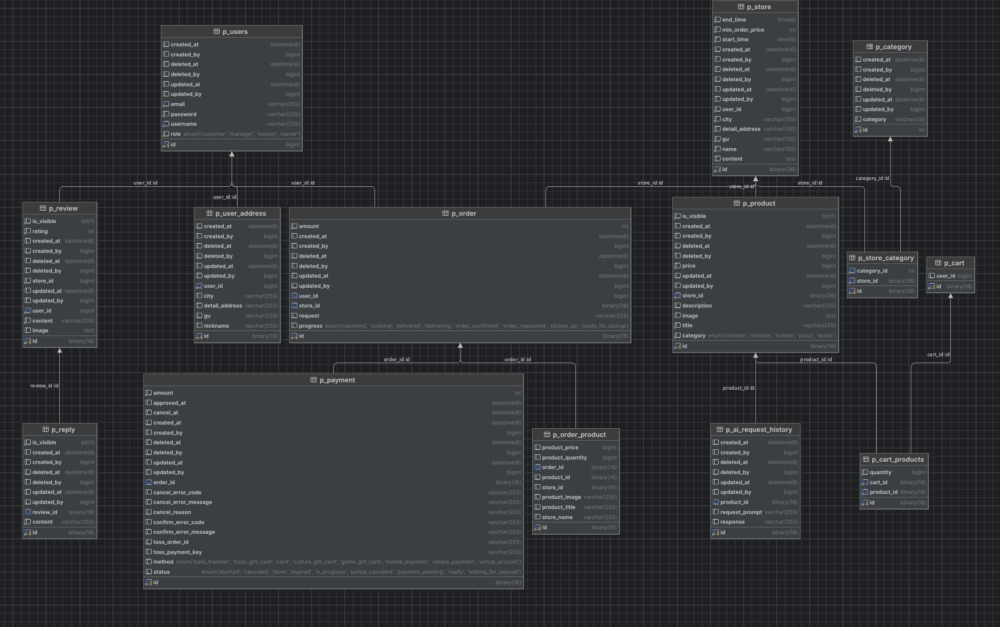

# delivery-app

## 프로젝트 목적

### 음식 주문 관리 플랫폼

    - 음식점들의 배달 주문 관리, 결제, 그리고 주문 내역 관리 기능을 제공

## 팀원

<table style="width:100%; text-align:center;">
    <thead>
        <tr>
            <th style="width:15%; text-align:center;">이름</th>
            <th style="width:55%; text-align:center;">역할</th>
            <th style="width:30%; text-align:center;">깃허브</th>
        </tr>
    </thead>
    <tbody>
        <tr>
            <td>김선우</td>
            <td>검색, 가게 기능 개발</td>
            <td><a href="https://github.com/mathos6147"></a></td>
        </tr>
        <tr>
            <td>박래현</td>
            <td>리뷰 기능 개발</td>
            <td><a href="https://github.com/Raebagi"></a></td>
        </tr>
        <tr>
            <td>박진성</td>
            <td>회원 기능 개발</td>
            <td><a href="https://github.com/Sp-PJS"></a></td>
        </tr>
        <tr>
            <td>석미혜</td>
            <td>상품, 결제 기능 개발</td>
            <td><a href="https://github.com/mmihye"></a></td>
        </tr>
        <tr>
            <td>이예나</td>
            <td>장바구니 기능 개발</td>
            <td><a href="https://github.com/yeana07"></a></td>
        </tr>
    </tbody>
</table>

## 서비스 구성 및 실행 방법

-   git clone 진행

```
git clone https://github.com/TeamOpportunity/Delivery-Service.git
```

-   application.yml 혹은 application.properties 설정 추가

```
spring:
  #Mysql 설정
  datasource:
    url: jdbc:mysql://localhost:3306/사용할_데이터베이스_이름
    username: 유저네임
    password: 패스워드
    driver-class-name: com.mysql.cj.jdbc.Driver

  #JPA/Hibernate 설정
  jpa:
    hibernate:
      ddl-auto: update
    properties:
      hibernate:
        show_sql: true
        format_sql: true
        use_sql_comments: true

  #Redis 설정
  data:
    redis:
      host: localhost
      port: 6379
      password:

#JWT 설정
jwt:
  secret:
    key: jwt시크릿키

  admin:
    token: 토큰 값

gemini:
  url: https://generativelanguage.googleapis.com/v1beta
  api-key: api키
  
toss:
  base-url: https://api.tosspayments.com/
  secret-key: 시크릿키

feign:
  client:
    config:
      tossPaymentsClient:
        loggerLevel: FULL
        connectTimeout: 5000
        readTimeout: 10000
```

-   스프링 부트 실행

<br>

## 개발 환경

<table style="width:100%; text-align:center;">
    <thead>
        <tr>
            <td style="width:30%;">Backend</td>
            <td style="width:20%;">IDE</td>
            <td style="width:20%;">Database</td>
            <td style="width:15%;">버전 관리</td>
            <td style="width:15%;">기타</td>
        </tr>
    </thead>
    <tbody>
        <tr>
            <td>SpringBoot 3.5.6</td>
            <td>Intellij</td>
            <td>MySql</td>
            <td>Github</td>
            <td>Postman</td>
        </tr>
        <tr>
            <td>Java 17</td>
            <td></td>
            <td></td>
            <td></td>
            <td>Notion</td>
        </tr>
        <tr>
            <td>Gradle</td>
            <td></td>
            <td></td>
            <td></td>
            <td></td>
        </tr>
        <tr>
            <td>Spring Boot JPA</td>
            <td></td>
            <td></td>
            <td></td>
            <td></td>
        </tr>
    </tbody>
</table>
<br>

## ERD



## API 명세서

[API명세서 노션 링크](https://www.notion.so/teamsparta/27a2dc3ef51481908b12d2909597546c?v=27a2dc3ef51481a49086000cf86569ba)